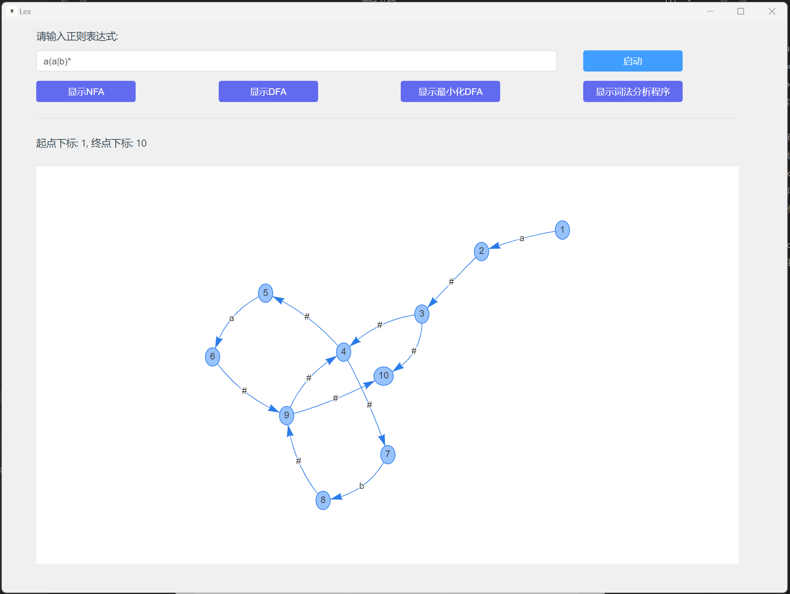
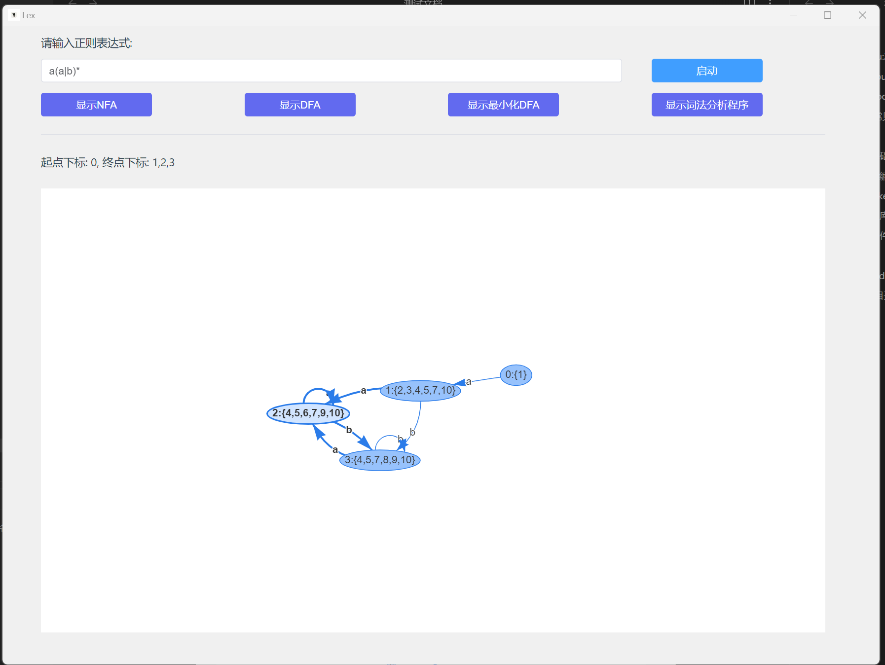
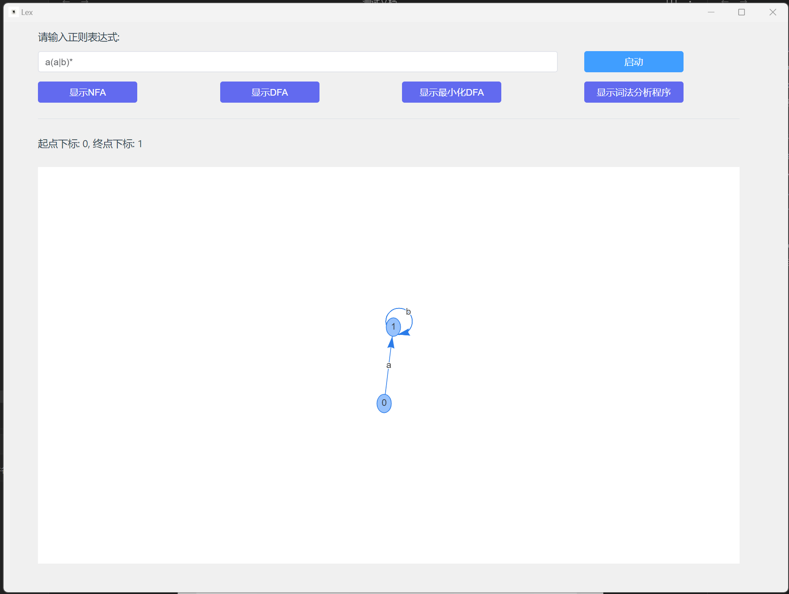
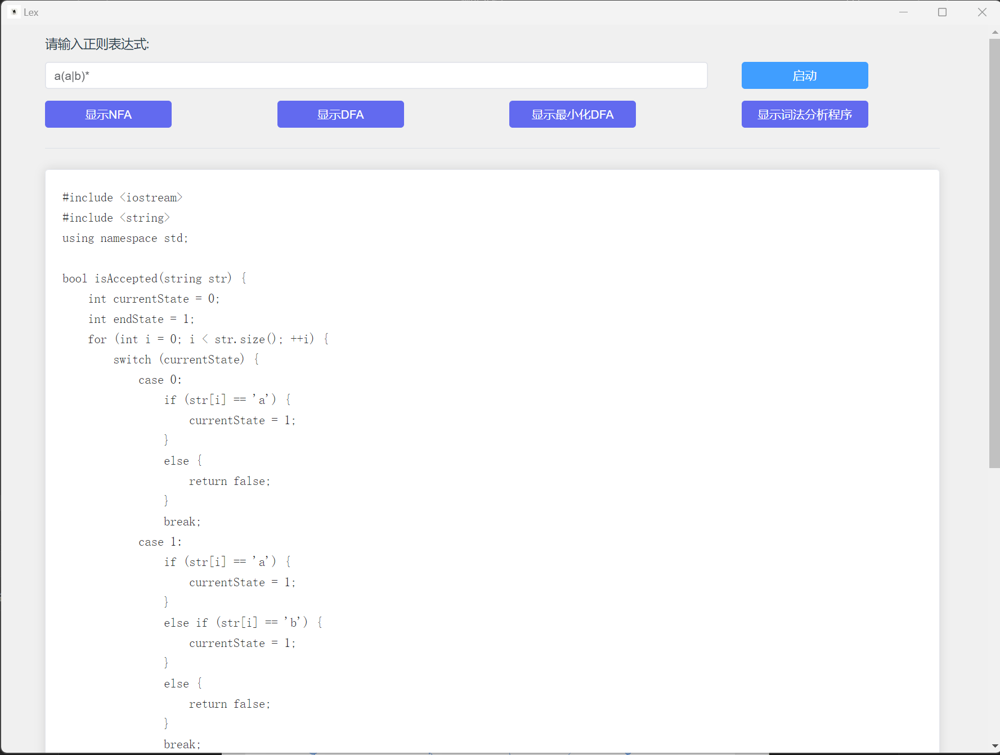
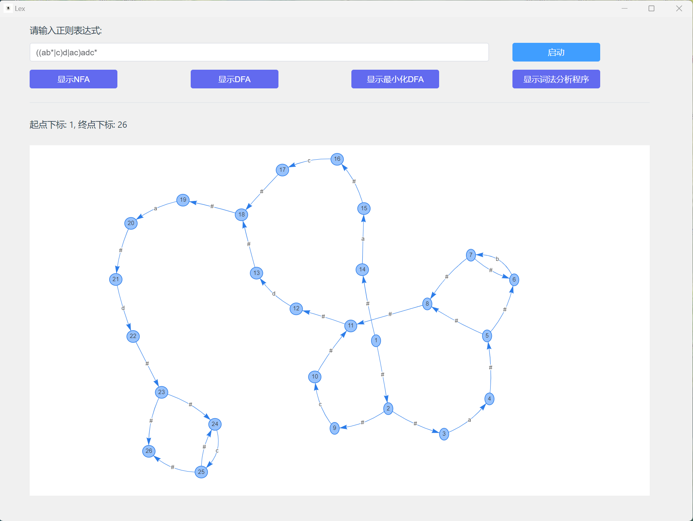
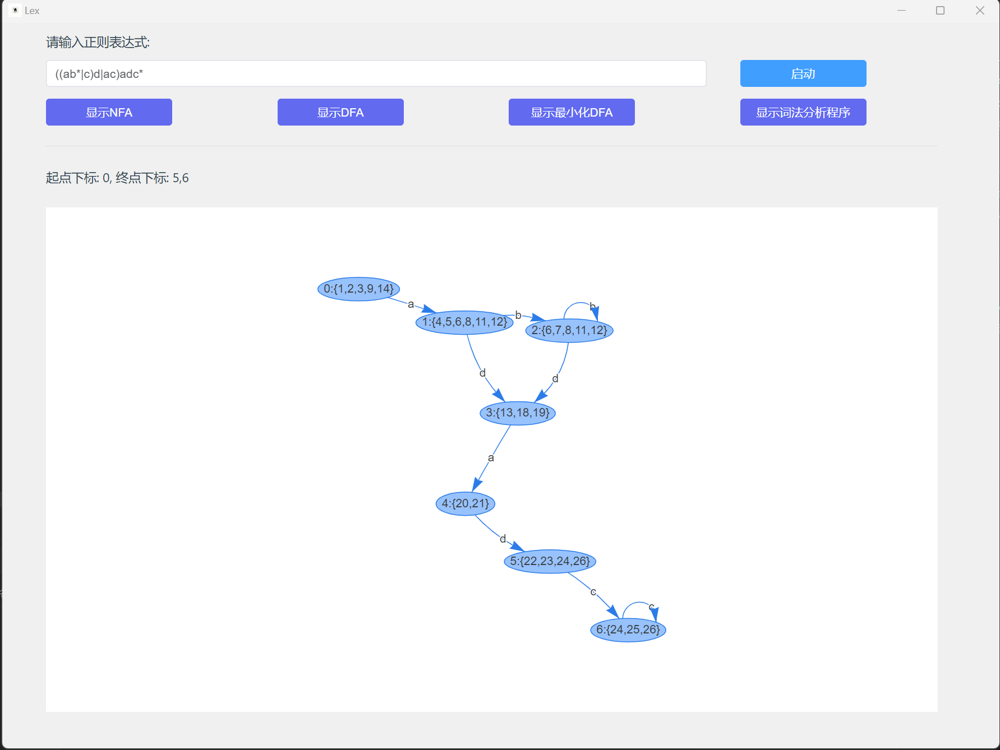
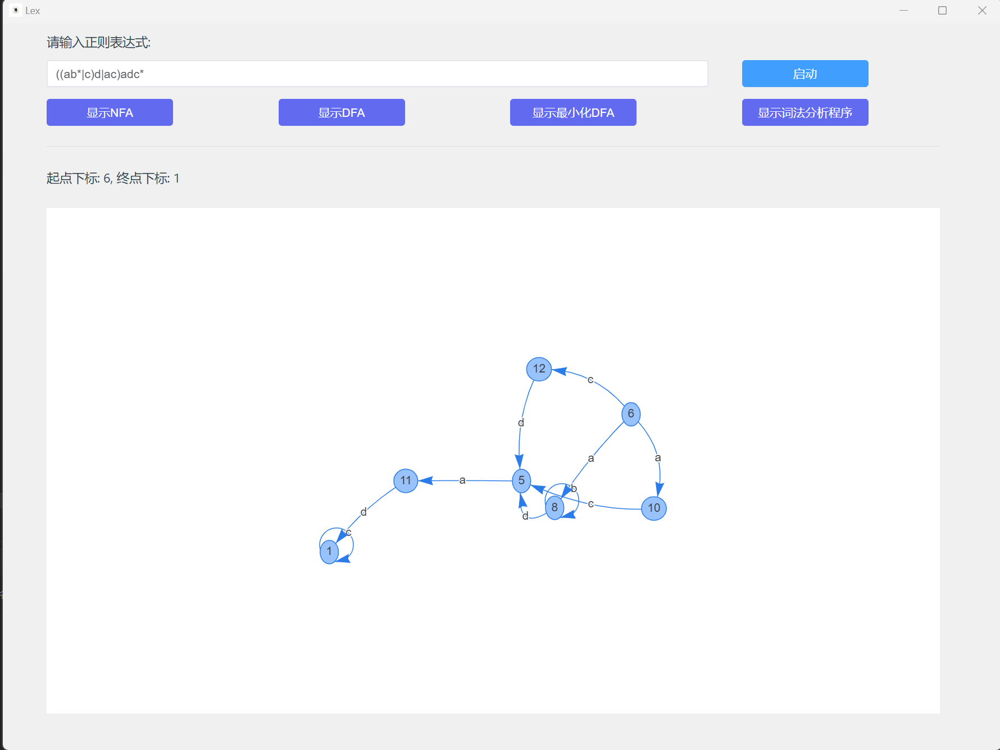
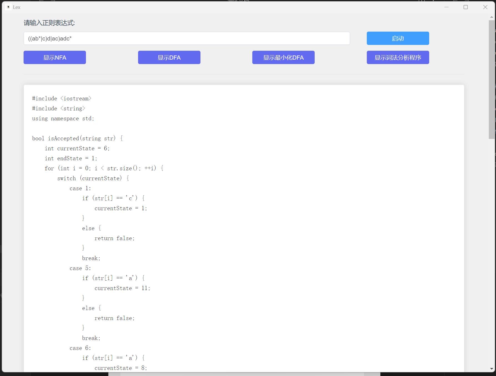

# 功能

将正则表达式 ->  `NFA` （ `Thompson` 构造法 ）-> `DFA` （子集构造法） -> 最小化 `DFA` （ `Hopcroft` 算法） -> 词法分析程序。

# 示例

测试数据1 `a(a|b)*` ：






这里稍微在前端绘制拓扑图的时候有一点 `bug` ，如果一个节点同时有两条不同的回边，那这两条回边会重合。





```cpp
#include <iostream>
#include <string>
using namespace std;

bool isAccepted(string str) {
    int currentState = 0;
    int endState = 1;
    for (int i = 0; i < str.size(); ++i) {
        switch (currentState) {
            case 0:
                if (str[i] == 'a') {
                    currentState = 1;
                }
                else {
                    return false;
                }
                break;
            case 1:
                if (str[i] == 'a') {
                    currentState = 1;
                }
                else if (str[i] == 'b') {
                    currentState = 1;
                }
                else {
                    return false;
                }
                break;
            default:
                return false;
        }
    }
    if (currentState == endState) {
        return true;
    }
    return false;
}

int main() {
    string str;
    cin >> str;
    if (isAccepted(str)) {
        cout << "accepted" << endl;
    }
    else {
        cout << "can not accepted" << endl;
    }
    return 0;
}
```

测试数据2 `((ab*|c)d|ac)adc*` ：










```cpp
#include <iostream>
#include <string>
using namespace std;

bool isAccepted(string str) {
    int currentState = 6;
    int endState = 1;
    for (int i = 0; i < str.size(); ++i) {
        switch (currentState) {
            case 1:
                if (str[i] == 'c') {
                    currentState = 1;
                }
                else {
                    return false;
                }
                break;
            case 5:
                if (str[i] == 'a') {
                    currentState = 11;
                }
                else {
                    return false;
                }
                break;
            case 6:
                if (str[i] == 'a') {
                    currentState = 8;
                }
                else if (str[i] == 'c') {
                    currentState = 12;
                }
                else if (str[i] == 'a') {
                    currentState = 10;
                }
                else {
                    return false;
                }
                break;
            case 8:
                if (str[i] == 'b') {
                    currentState = 8;
                }
                else if (str[i] == 'd') {
                    currentState = 5;
                }
                else {
                    return false;
                }
                break;
            case 10:
                if (str[i] == 'c') {
                    currentState = 5;
                }
                else {
                    return false;
                }
                break;
            case 11:
                if (str[i] == 'd') {
                    currentState = 1;
                }
                else {
                    return false;
                }
                break;
            case 12:
                if (str[i] == 'd') {
                    currentState = 5;
                }
                else {
                    return false;
                }
                break;
            default:
                return false;
        }
    }
    if (currentState == endState) {
        return true;
    }
    return false;
}

int main() {
    string str;
    cin >> str;
    if (isAccepted(str)) {
        cout << "accepted" << endl;
    }
    else {
        cout << "can not accepted" << endl;
    }
    return 0;
}
```


除了绘制拓扑图的显示有点问题，如果存在多重重边会重合连线，其它应该没大问题。


# 编译方式

`cpp` 程序采用 `CMake` 编译。

前端程序先在 `exp02` 文件中通过 `npm run build` 命令打包 `vue3` 界面程序，生成的结果在同目录的 `dist` 目录中。然后把 `dist` 目录中的文件全部复制到 `electron-exp` 目录中，然后这里需要注意的是，需要修改这里复制文件中的 `index.html` 中链接的 `css` 和 `js` 文件路径，将绝对路径 `/xxx` 修改为相对路径 `xxx` 。然后执行 `electron-builder` 命令打包。最后就会在该目录的 `dist` 目录下生成 `exe` 程序。
