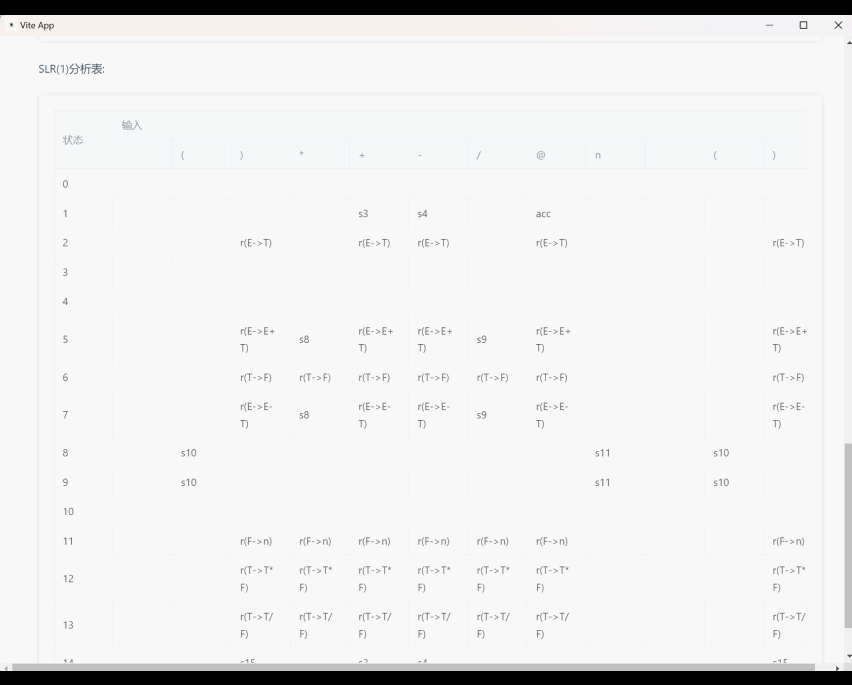

# 运行方式
下面的第一步和第二步其实已经帮忙做好了。
1. 进入源代码的前端目录中，在其中的 `vue` 项目中运行下面的命令打包前端程序。
```text
npm install
npm run build
```
2. 然后将打包后的 `dist` 目录中的内容放到 `electron` 项目的根目录中。需要注意的是，这里需要修改 `index.html` 中静态文件的路径，将前面的 `/` 去掉，也就是改为相对路径。
```html
# 原始的
<script type="module" crossorigin src="/assets/index-b79980b0.js"></script>
<link rel="stylesheet" href="/assets/index-53c77a11.css">
# 改为下面的形式
<script type="module" crossorigin src="assets/index-b79980b0.js"></script>
<link rel="stylesheet" href="assets/index-53c77a11.css">
```
3. 运行下面的命令打包 `electron` 程序。然后就会得到一个单独的 `exe` 程序。
```text
npm install
electron-builder
```

# 运行界面

## 测试一

```text
E->E+n
E->n
```


## 测试二
```text
S->(S)S
S->@
```


## 测试三
```text
E->aA
E->bB
A->cA
A->d
B->cB
B->d
```


## 测试四
```text
E->E+T
E->E-T
E->T
T->T*F
T->T/F
T->F
F->(E)
F->n
```




## 测试五（测试非SLR1文法的报错）
```text
S->C
S->A
S->B
C->i
A->V=E
B->W=T
V->i
V->a
E->V
E->n
W->i
T->b
```


## 测试六（测试非SLR1文法的报错）
```text
S->I
S->o
I->i()S
I->i()SeS
```


